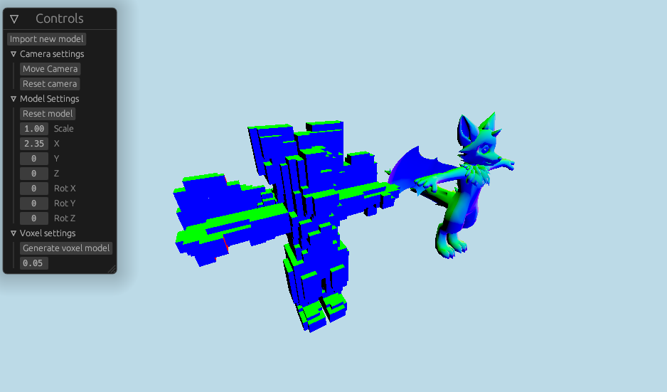
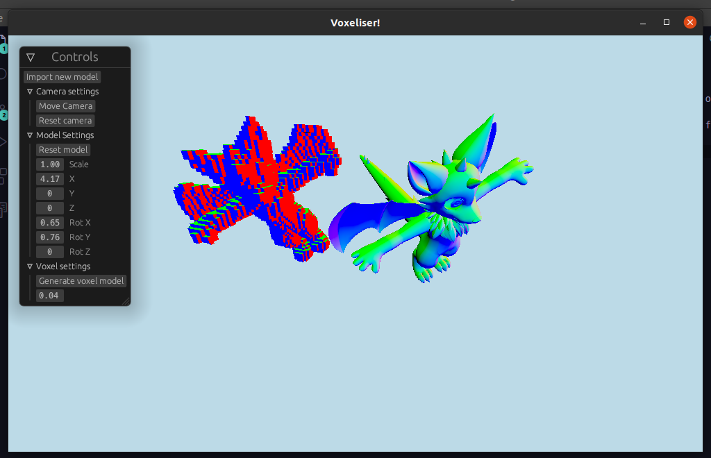

# Voxeliser

This project, written in Rust, takes in a 3D model and creates a voxelised version of it, examples below.

# Getting started

When running the program, it will prompt the user to import a 3D model by selecting either a `glb`, `gltf` or `obj` file. Once a model is imported it will render a basic view of it and expose a number of controls to transform the model's scale, position and rotation. You can also press the `Move camera` button to enter an FPS-like control scheme to move the camera around (press `esc` at any time to exit this mode). Once you are happy with the position of your 3D model, you can press `Generate voxel model` to create a voxelised version of your model. Depending on how small the voxels are and the size and polycount of your model this can take several minutes (so you should probably run it in release mode).

Currently there is no way to export or save a voxel model, you can just look at it for now.

Note:
This currently uses a very primitive technique of checking if the bounding-box of each triangle collides with the bound-box of each voxel, which means models with large polygons can have poor results.

# Compiling

Make sure you have `rustc` and `cargo` installed,
Run `cargo run --release`

# Demo images

